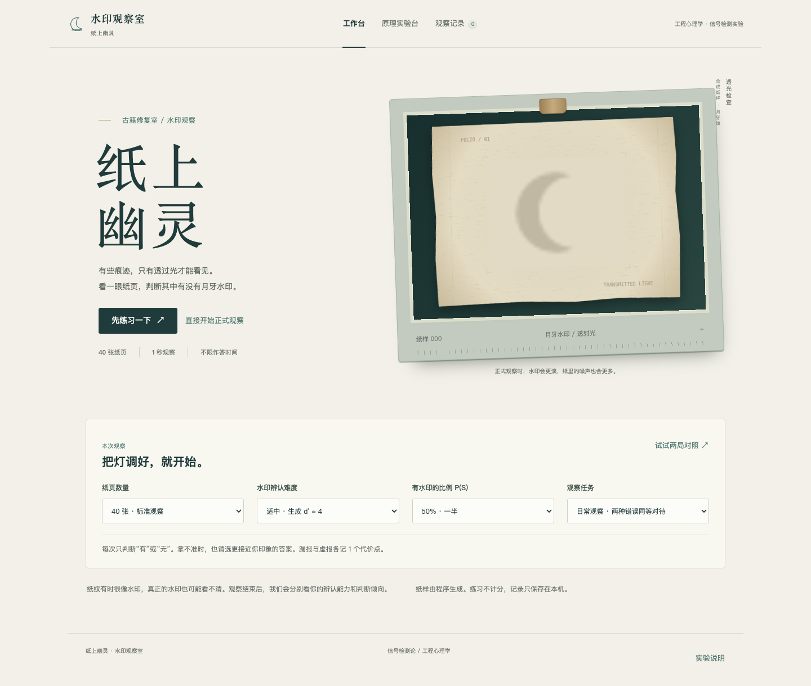

# 纸上幽灵 · 水印观察室

工程心理学课程作业：一个可以直接在浏览器里玩的信号检测论实验。

纸页透光一秒，然后被遮住。你需要判断中央有没有月牙水印。真正的水印可能被噪声盖住，噪声也可能恰好像一枚月牙。完成一局后，页面分别计算敏感性 `d′` 和判断标准 `c`，再用图表说明“看得清不清”和“愿不愿意报有”的区别。

纸样全部由程序合成，不使用真实馆藏图片，也不用于文物鉴定。



## 直接运行

1. 下载整个仓库；如果下载的是 ZIP，先解压。
2. 双击 `index.html`，用现代浏览器打开。
3. 点击“先练习一下”，或者熟悉操作后直接开始正式观察。

无需安装依赖、启动服务器或注册账号。页面、字体回退、图标、图表和纸页生成都在本地运行，断网也可以完成实验。建议使用电脑，在观察过程中保持窗口大小和缩放比例不变。

源码仓库：[zxsandglass11-wq/paper-ghost-sdt-lab](https://github.com/zxsandglass11-wq/paper-ghost-sdt-lab)。使用仓库中的 MIT 许可证，见 [LICENSE](LICENSE)。

## 怎么玩

每张纸页先显示注视提示，再透光呈现 **1,000 毫秒**。纸页消失后才接受回答，作答时间不限。

目标是比周围**较深的月牙轮廓**，位置固定在中央。浅色的反向轮廓不算目标。

| 操作 | 按钮或按键 |
| --- | --- |
| 回答没有水印 | “没有水印”按钮，或 `←` |
| 回答有月牙水印 | “有月牙水印”按钮，或 `→` |
| 暂停 | “暂停”按钮，或 `P` |
| 全屏 / 退出全屏 | `F`；也可用浏览器的退出全屏操作 |
| 结束未完成的一局 | “结束本次”，再确认离开 |

练习有 6 次，每次说明答案和错误类型，不写入正式成绩。正式局不即时公布对错，结束后可以查看逐次记录。长按或重复点击不会多记一次回答。

切换标签页、窗口失去焦点或手动暂停时，未完成作答的纸页作废；继续后换一张同类别的新纸页，保持整局比例不变。已提交的回答保留。未完成整局就离开，不会把半局数据混入历史比较。

## 正式局的设置

| 参数 | 可选值 | 默认 |
| --- | --- | --- |
| 纸页数量 | 20 / 40 / 80 | 40 |
| 生成分离度 `d′gen` | 2（微弱）/ 4（适中）/ 6（清晰） | 4 |
| 有水印的比例 `P(S)` | 25% / 50% / 75% | 50% |
| 呈现时间 | 固定 1,000 毫秒 | 1,000 毫秒 |
| 观察任务 | 日常观察 / 线索普查 / 证据确认 | 日常观察 |

正式局开始后锁定参数。程序先按比例确定两类纸页的数量，再随机打乱。例如 40 张、`P(S)=25%`，这一局恰好有 10 张带水印、30 张不带水印；不是每次重新独立抽签。局中不显示剩余类别数量。

生成 `d′gen` 描述合成刺激的条件。结果页的 `d′` 根据玩家回答估计，两者不要求相等。

## 三种任务与两局对照

| 任务 | 漏报代价 | 虚报代价 | 工作要求 |
| --- | ---: | ---: | --- |
| 日常观察 | 1 | 1 | 两种错误同等对待 |
| 线索普查 | 4 | 1 | 尽量别漏掉线索 |
| 证据确认 | 1 | 4 | 谨慎确认有水印 |

正确判断代价为 0，错判代价越少越好。每局开始前会明确展示规则。

工作台上的“试试两局对照”会安排一局普查和一局确认，顺序随机。两局保持数量、先验、生成分离度和呈现时间相同，重新生成纸样。完成后比较两局的 `c`、命中率和虚报率，看看任务要求是否改变了自己的回答倾向。

结果按真实作答计算，不保证每个人都出现“普查更宽松、确认更谨慎”的变化。不同任务的代价规则不同，不能据此跨任务排名。

## 结果怎么算

| 实际纸页 | 回答有水印 | 回答无水印 |
| --- | --- | --- |
| 有水印 | H：命中 | M：漏报 |
| 无水印 | FA：虚报 | CR：正确拒绝 |

令 `Ns = H + M`、`Nn = FA + CR`、`N = Ns + Nn`。结果页上方显示原始比例：

```text
命中率 = H / Ns
虚报率 = FA / Nn
准确率 = (H + CR) / N
```

计算 `d′` 和 `c` 时统一使用 log-linear 修正，避免 0% 或 100% 带来无穷值：

```text
h = (H + 0.5) / (Ns + 1)
f = (FA + 0.5) / (Nn + 1)
d′ = Φ⁻¹(h) − Φ⁻¹(f)
c  = −[Φ⁻¹(h) + Φ⁻¹(f)] / 2
```

`Φ⁻¹` 是标准正态分布的分位数函数。原始命中率、原始虚报率和准确率不做上述修正。结果页展开“这些数是怎么算的？”即可查看本局代入过程。

`c < 0` 表示相对宽松，`c > 0` 表示相对谨慎。负 `d′` 会照实保留，通常说明这局修正后的命中率低于修正后的虚报率；它不是程序故障，也不能直接解释为稳定的个人能力。样本少或两类数量不等时，修正和抽样波动都会影响估计。

作答用时从纸页被遮住、回答按钮可用后开始计时，不包含前面的观察时间，不把它当作纯粹的视觉反应时。

方法依据：[Hautus（1995）](https://doi.org/10.3758/BF03203619)、[Stanislaw 与 Todorov（1999）](https://doi.org/10.3758/BF03207704)。

## 原理实验台与多局比较

原理实验台使用方差相同的两条正态分布 `N(−d′/2, 1)`、`N(+d′/2, 1)`，判断线位于 `c`。调节 `d′` 会改变分布间距和整条理论 ROC；调节 `c` 会改变命中与虚报的面积，让预测点沿同一条 ROC 移动。

调节先验只改变两类纸页的权重。因此，固定 `d′`、`c` 时，理论命中率和虚报率不变，四类结果的预期数量和准确率可以改变。

ROC 的实线和圆点来自理论模型，菱形是玩家原始命中率与虚报率构成的观测点。一局二分类回答只提供一个经验点，不能称为完整的实测 ROC。滑块只改变概念演示，不修改已保存的回答。

在“观察记录”里选择 2–3 局，可以按相同坐标尺度比较 `d′`、`c`、命中率、虚报率、准确率和代价。条件不同或设备记录不同时，页面会提醒，避免把条件变化误读为能力提高。

## 保存与导出

页面保留最近 30 局完整记录，优先使用当前浏览器的 `localStorage`。记录不会上传服务器。

浏览器对本地 `file://` 页面的存储支持可能不同。隐私模式、禁止本地存储、移动文件位置、清理浏览器数据或更换浏览器，都可能影响旧记录的访问。保存失败时，页面会保留本次会话中的记录，并提示导出；游戏和多局比较仍可使用。

- **保存全部记录（JSON）**：用于备份和再次导入，包含参数、真实标签、回答、随机种子、日期和设备信息。
- **导入记录（JSON）**：校验参数、试次数、有水印数量和字段类型；重复编号不重复添加。统计值从原始回答重新计算，不采用文件自带的成绩。
- **导出表格（CSV）**：每试次一行，附本局参数、四类计数和重新计算的统计值，可以用常用表格软件查看。

关闭页面前建议保存一份 JSON。CSV 便于分析，JSON 才能恢复完整历史记录。

## 文件结构

```text
index.html                页面结构与中文说明
styles.css                布局、纸页灯箱、窄屏与减少动态样式
game.js                   练习、试次流程、输入、暂停、结果和历史界面
sdt.js                    正态分布、SDT 计算、随机数与试次安排
stimulus.js               月牙模板、噪声模型与 Canvas 纸页绘制
charts.js                 分布、ROC、预期结果与多局 SVG 图表
storage.js                本地保存、校验、JSON / CSV
assets/mark.svg           本地图标
tests/core.test.js        数学和刺激核心检查
tests/storage.test.js     导入、导出与存储检查
tests/browser.test.cjs    开发用浏览器流程检查
verification/            验证记录与页面截图
LICENSE                   MIT 许可证
```

代码采用普通脚本和明确的全局命名空间，不依赖模块服务器、构建流程或在线资源。图标和纸样由本项目代码绘制，未使用外部图片素材；中文字体使用设备上的系统字体。

## 开发检查

这些工具只用于开发和验证，助教运行网页不需要安装。

安装 Node.js 后，在项目目录执行数学与存储检查：

```sh
node --test tests/core.test.js tests/storage.test.js
```

浏览器流程检查另外需要 Playwright 和 Chromium：

```sh
npm install --no-save --package-lock=false playwright@1.62.1
npx playwright install chromium
node tests/browser.test.cjs
```

浏览器脚本以离线 `file://` 方式打开页面，检查练习和正式局、暂停与重复输入、两局对照、极端比例、导入导出、存储失败和窄屏布局。它的作答是自动化检查输入，不是人的实验数据；生成的截图和 CSV 也不应当拿来冒充真实被试结果。

实际运行环境、检查结果和截图见 [验证记录](verification/验证记录.md)。
